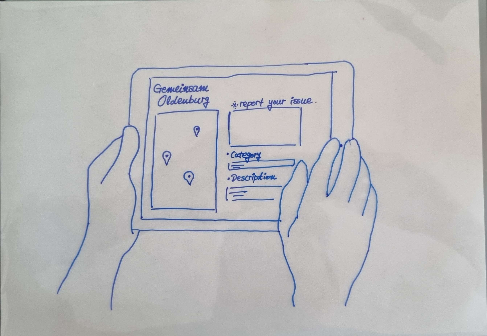
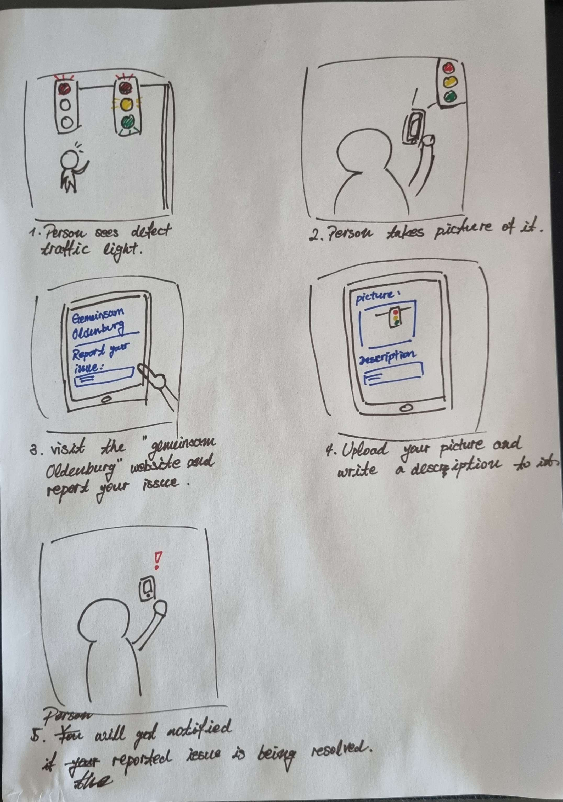
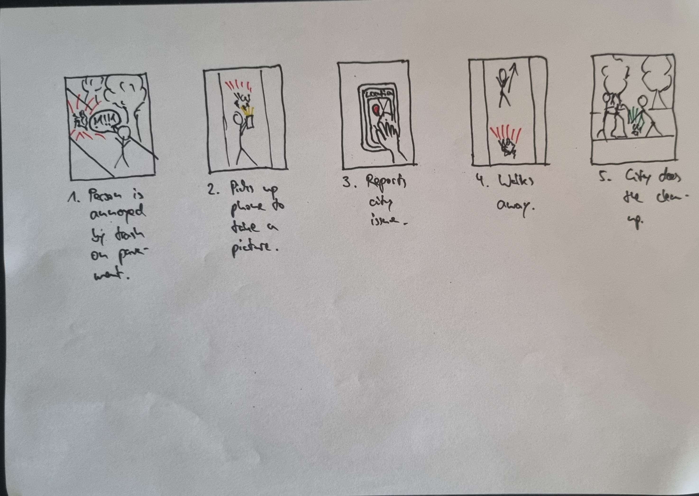
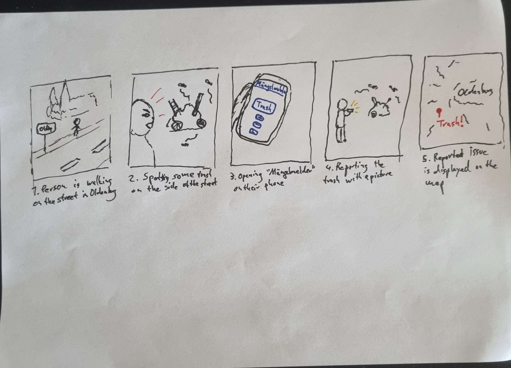

# April 19, 2025: Brainstorming first ideas
## Project requirements
- **Goal**: make it smarter and more user-friendly
	- Issues: unclear categorization, privacy
- **Mean**: user-centered design approach
- **Artifact**: design an innovative User Interface
## Idea 1: Derive requirements from interviews and conduct within-person evaluation
### Gathering Insights
- Next step in the human-centered design approach/project: **gather insights**
	- Look for app reviews, scrape, and analyze using some natural language processing methods
	- Interviews
- We prefer interviews over scraping for reviews, because there are no reviews for the gemeinsam.Oldenburg website
- Ideas on how to proceed with interviews
	- Instruct our friends to use the website/tool for 1-2 weeks
	- Later conduct an interview to gather their feedback (e.g., using qualitative content analysis)
	- While they use the tool, we can design the guided interview
	- Aim: 2-3 interviewees
### Evaluation
	- Perhaps, add some sort of questionnaire: We could use it to conduct a within-person comparison of the original tool to our improved tool.

# April 23, 2025: Preparing the first presentation and next steps
## Idea 2: Derive requirements from existing knowledge and conduct (between-person) evaluation
### Gathering insights
- Are the issues mentioned in the slide part of existing knowledge? -> Ask Dennis (perhaps, using an expert interview)
- Scraping app store reviews of other apps and derive user requirements on that basis
- Or, if categories are an issue, scrape complaints on gemeinsam.Oldenburg site, use e.g., a topic model and derive new categories on that basis
### Evaluation
- Based on our requirements, we can design mockups
- These could also be suitable for A/B testing or, perhaps more advanced, conjoined experiments or factorial survey designs
## Our thoughts
- We are leaning towards idea 2, as it easier to realize within the time frame of the course
## Presentation
- Main points of the project
- Present idea 2
## TODOs
- Michael: prepare two slides
- Michael: send mail with availability (Wednesday, 2pm or afterwards, preferably online)
- Marten: research mockup design
- Minu: research scraping options
  
# April 30, 2025: First Meeting with Dennis

## Communication & Feedback
- Dennis requests to be regularly informed about any feedback recieved from Tobias

## 🛠Current Issues with Mängelmelder
- Mängelmelder is managed by an external company.
- Categories are unclear to citizens; users don’t understand what the labels mean.
- Personal data requirements are a barrier — a common issue across Mängelmelder in Germany.
- Currently, the platform can only be used after registering.
- Accessibility issues: language barriers and the login/register process hinder usability.

## Research & Evaluation Planning
- Recommended number of interviewees: 4–6.
- Plan to conduct user interviews with fellow students based on existing knowledge/requirements.
- Possibility of conducting expert interviews discussed.

## Interview & Survey Design
- Need to assess whether users actually perceive categorization as a problem.
- Suggestion: Replace long interviews with a survey including a short interview section.
- Scraping content for insights or dataset generation – feasibility of scraping pictues questioned.
- Evaluation idea: Have users categorize or interpret images of posts.
- Dennis suggests the use of subcategories to improve clarity.
- Consideration of appropriate interview types for this context.

## UI & Prototyping
- Figma might be used for prototyping UI elements.
- Dennis emphasizes the importance of delivering an idea for a UI design as part of the project requirment.
- Drop-down menus for categories are overwhelming.
- Suggested improvement: hierarchical selection with main and subcategories via step-by-step interface.
- Another Idea: integrate ai image recognition into Mängelmelder to enhance usability.

## Tools & Next Steps
- Survey tools considered: Google Forms, LimeSurvey.
- Communication with Dennis will continue via Discord.
- Next meeting: finalize research and design ideas

# May 6, 2025 - Answering Gathering Insights Questions / Problem Analysis Design Thinking

## Context: 
### Where your system is going to be used?
### When your system is going to be used?

- On the street right after spotting issue / later at home
### Why your system is going to be used?
- Issues might propose dangers to public
- users want there direct surroundings to be pretty and safe
- users want public space to be working
## Stakeholders

### By whom your system is going to be used?
- People living in Oldenburg, adults
### Whose needs have to be considered?
### Who will be affected by the usage?
- people using the system
- people maintaining the system
- people taking care of the issues
- people living Oldenburg, no using the system

NOTE: Who actually takes care of removing the issues? How do they use the platform? -> Ask Dennis!!!

## Design Thinking
### User need
User: People spotting issues in Oldenburg
Need: stressful lives, need to have an easy way to communicate issues
Insight: everybody has a smartphone in their pocket

People spotting issues in Oldenburg need an easy way to communicate that issue in a way that is quick and easy.

### How might we?

How might we make Mängelmelder quicker and easier to use?

# May 7, 2025 - Weekly Meeting
- Some more discussion about the stakeholders: Who actually takes care of removing the issues? How do they use the platform? -> Ask Dennis!!!
- Developing a survey to test categories with pictures, discussing Michaels survey draft in LimeSurvey
- decision to kick out first question, and expand on the
## TODOS:
- finish presentation
- Minu: look into scraping reported issues for clustering
- Michael: finish LimeSurvey
- Marten: research methods for clustering (maybe topic modells)

# May 16, 2025 – Sketch Workshop Results

## Workshop Photo

## Storyboard 1

## Storyboard 2

## Storyboard 3

# May 20, 2025 - Piloting Thinking Aloud 
- conducting first thinking aloud interview
- subject is told to spot an issue in the city and report it via the city issue service
- while using the service the subject should be thinking out loud and notes are taken by the interviewee
- during the interview there were some difficulties, because the service was unreachable
- eventually the subject could find a working link with some intervention
- after the thinking aloud process a NASA-TLX survey was filled out by the subject
- The issue spotted was a leaking salt container

